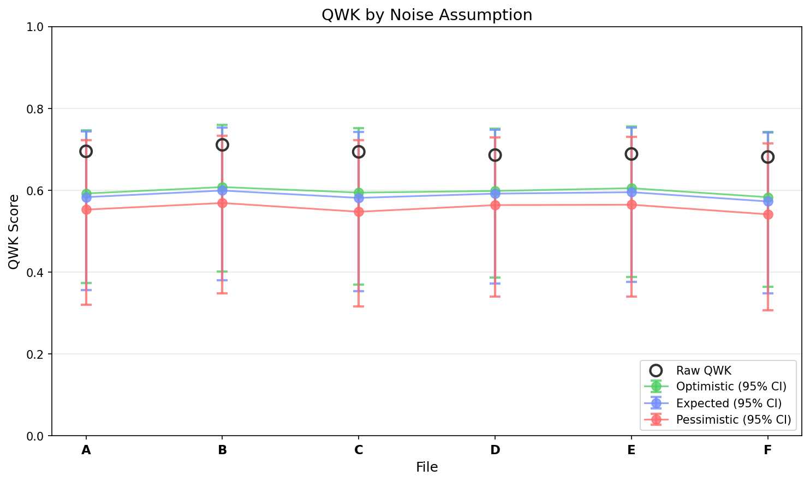
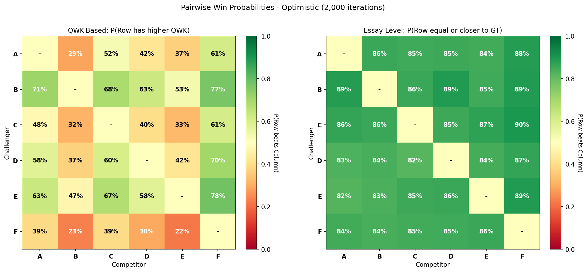
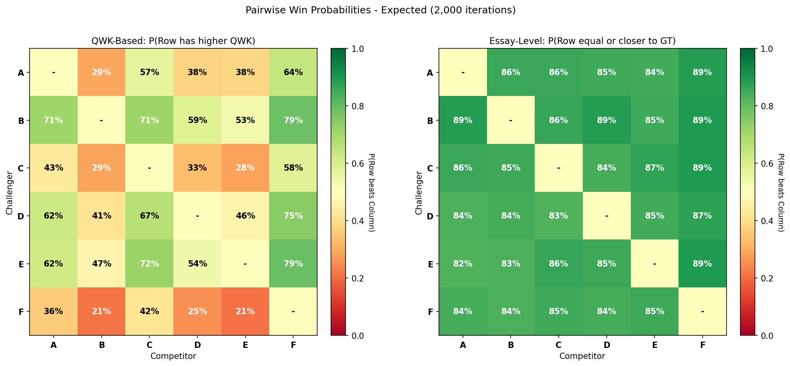
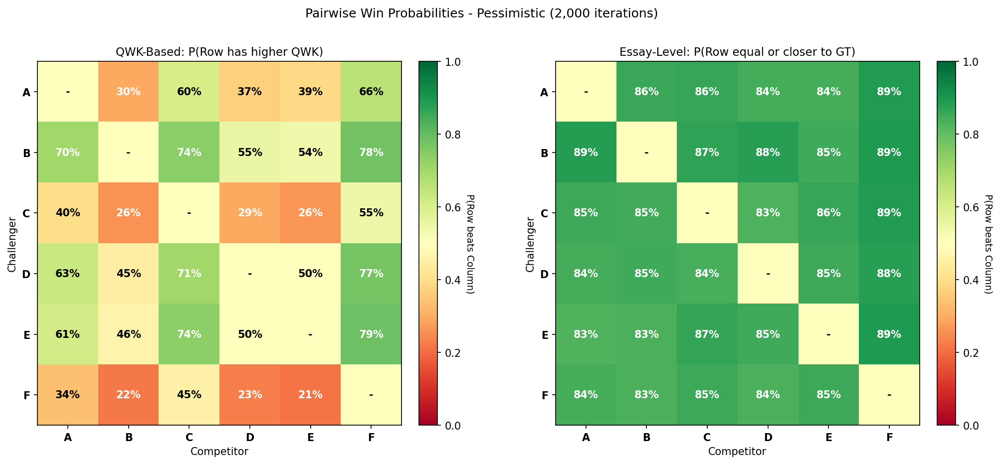

# EGF Analysis Report

**Generated:** 2026-01-02 19:11:18

**Source EDF:** halena_section_1_q1.edf

**Grading:** Experiment 2 (Scaling N): N=5, 48 targets, 30 permutations. Testing grading quality as number of anchors increases.

**Files analyzed:** 6

## Legend

- **A**: `n5.egf`

- **B**: `n10.egf`

- **C**: `n15.egf`

- **D**: `n20.egf`

- **E**: `n25.egf`

- **F**: `n30.egf`

---

## Summary

| Label | Raw QWK | Exact Acc | Near Acc | CI (Expected, Combined) |
|-------|---------|-----------|----------|-------------------------|
| **A** | 0.6948 | 22.9% | 45.8% | [0.356, 0.743] |
| **B** | 0.7108 | 20.8% | 45.8% | [0.380, 0.753] |
| **C** | 0.6937 | 18.8% | 45.8% | [0.353, 0.742] |
| **D** | 0.6857 | 16.7% | 45.8% | [0.371, 0.747] |
| **E** | 0.6885 | 20.8% | 45.8% | [0.376, 0.752] |
| **F** | 0.6810 | 18.8% | 43.8% | [0.348, 0.741] |

## Visualizations

### QWK by Noise Assumption

### Pairwise Comparison Heatmaps

#### Optimistic Assumption

#### Expected Assumption

#### Pessimistic Assumption

---

## Detailed Results

Shows QWK confidence intervals under 3 noise assumptions (optimistic/expected/pessimistic) and 4 CI types.

### A (48 essays)

**Raw QWK:** 0.6948 | **Exact Acc:** 22.9% | **Near Acc:** 45.8%

| CI Type | Assumption | Mean QWK | 95% CI |
|---------|------------|----------|--------|
| Sampling Only | Optimistic | 0.6748 | [0.473, 0.811] |
| Sampling Only | Expected | 0.6748 | [0.473, 0.811] |
| Sampling Only | Pessimistic | 0.6748 | [0.473, 0.811] |
| LLM Noise | Optimistic | 0.6879 | [0.658, 0.714] |
| LLM Noise | Expected | 0.6879 | [0.658, 0.714] |
| LLM Noise | Pessimistic | 0.6879 | [0.658, 0.714] |
| Teacher Noise | Optimistic | 0.6146 | [0.538, 0.688] |
| Teacher Noise | Expected | 0.6046 | [0.513, 0.688] |
| Teacher Noise | Pessimistic | 0.5727 | [0.460, 0.671] |
| All Combined | Optimistic | 0.5919 | [0.374, 0.746] |
| All Combined | Expected | 0.5829 | [0.356, 0.743] |
| All Combined | Pessimistic | 0.5524 | [0.320, 0.722] |

### B (48 essays)

**Raw QWK:** 0.7108 | **Exact Acc:** 20.8% | **Near Acc:** 45.8%

| CI Type | Assumption | Mean QWK | 95% CI |
|---------|------------|----------|--------|
| Sampling Only | Optimistic | 0.6936 | [0.507, 0.821] |
| Sampling Only | Expected | 0.6936 | [0.507, 0.821] |
| Sampling Only | Pessimistic | 0.6936 | [0.507, 0.821] |
| LLM Noise | Optimistic | 0.7039 | [0.675, 0.729] |
| LLM Noise | Expected | 0.7039 | [0.675, 0.729] |
| LLM Noise | Pessimistic | 0.7039 | [0.675, 0.729] |
| Teacher Noise | Optimistic | 0.6292 | [0.556, 0.701] |
| Teacher Noise | Expected | 0.6199 | [0.531, 0.704] |
| Teacher Noise | Pessimistic | 0.5881 | [0.477, 0.686] |
| All Combined | Optimistic | 0.6075 | [0.401, 0.759] |
| All Combined | Expected | 0.5990 | [0.380, 0.753] |
| All Combined | Pessimistic | 0.5686 | [0.347, 0.733] |

### C (48 essays)

**Raw QWK:** 0.6937 | **Exact Acc:** 18.8% | **Near Acc:** 45.8%

| CI Type | Assumption | Mean QWK | 95% CI |
|---------|------------|----------|--------|
| Sampling Only | Optimistic | 0.6730 | [0.453, 0.810] |
| Sampling Only | Expected | 0.6730 | [0.453, 0.810] |
| Sampling Only | Pessimistic | 0.6730 | [0.453, 0.810] |
| LLM Noise | Optimistic | 0.6867 | [0.657, 0.712] |
| LLM Noise | Expected | 0.6867 | [0.657, 0.712] |
| LLM Noise | Pessimistic | 0.6867 | [0.657, 0.712] |
| Teacher Noise | Optimistic | 0.6170 | [0.540, 0.690] |
| Teacher Noise | Expected | 0.6027 | [0.511, 0.689] |
| Teacher Noise | Pessimistic | 0.5669 | [0.456, 0.667] |
| All Combined | Optimistic | 0.5940 | [0.369, 0.752] |
| All Combined | Expected | 0.5811 | [0.353, 0.742] |
| All Combined | Pessimistic | 0.5472 | [0.315, 0.722] |

### D (48 essays)

**Raw QWK:** 0.6857 | **Exact Acc:** 16.7% | **Near Acc:** 45.8%

| CI Type | Assumption | Mean QWK | 95% CI |
|---------|------------|----------|--------|
| Sampling Only | Optimistic | 0.6765 | [0.484, 0.805] |
| Sampling Only | Expected | 0.6765 | [0.484, 0.805] |
| Sampling Only | Pessimistic | 0.6765 | [0.484, 0.805] |
| LLM Noise | Optimistic | 0.6818 | [0.652, 0.711] |
| LLM Noise | Expected | 0.6818 | [0.652, 0.711] |
| LLM Noise | Pessimistic | 0.6818 | [0.652, 0.711] |
| Teacher Noise | Optimistic | 0.6208 | [0.546, 0.696] |
| Teacher Noise | Expected | 0.6136 | [0.521, 0.699] |
| Teacher Noise | Pessimistic | 0.5842 | [0.474, 0.684] |
| All Combined | Optimistic | 0.5980 | [0.386, 0.750] |
| All Combined | Expected | 0.5914 | [0.371, 0.747] |
| All Combined | Pessimistic | 0.5635 | [0.340, 0.729] |

### E (48 essays)

**Raw QWK:** 0.6885 | **Exact Acc:** 20.8% | **Near Acc:** 45.8%

| CI Type | Assumption | Mean QWK | 95% CI |
|---------|------------|----------|--------|
| Sampling Only | Optimistic | 0.6794 | [0.482, 0.804] |
| Sampling Only | Expected | 0.6794 | [0.482, 0.804] |
| Sampling Only | Pessimistic | 0.6794 | [0.482, 0.804] |
| LLM Noise | Optimistic | 0.6845 | [0.655, 0.712] |
| LLM Noise | Expected | 0.6845 | [0.655, 0.712] |
| LLM Noise | Pessimistic | 0.6845 | [0.655, 0.712] |
| Teacher Noise | Optimistic | 0.6271 | [0.548, 0.700] |
| Teacher Noise | Expected | 0.6166 | [0.524, 0.704] |
| Teacher Noise | Pessimistic | 0.5844 | [0.470, 0.683] |
| All Combined | Optimistic | 0.6048 | [0.388, 0.755] |
| All Combined | Expected | 0.5950 | [0.376, 0.752] |
| All Combined | Pessimistic | 0.5644 | [0.339, 0.730] |

### F (48 essays)

**Raw QWK:** 0.6810 | **Exact Acc:** 18.8% | **Near Acc:** 43.8%

| CI Type | Assumption | Mean QWK | 95% CI |
|---------|------------|----------|--------|
| Sampling Only | Optimistic | 0.6628 | [0.441, 0.801] |
| Sampling Only | Expected | 0.6628 | [0.441, 0.801] |
| Sampling Only | Pessimistic | 0.6628 | [0.441, 0.801] |
| LLM Noise | Optimistic | 0.6743 | [0.645, 0.700] |
| LLM Noise | Expected | 0.6743 | [0.645, 0.700] |
| LLM Noise | Pessimistic | 0.6743 | [0.645, 0.700] |
| Teacher Noise | Optimistic | 0.6069 | [0.527, 0.680] |
| Teacher Noise | Expected | 0.5945 | [0.499, 0.681] |
| Teacher Noise | Pessimistic | 0.5610 | [0.443, 0.660] |
| All Combined | Optimistic | 0.5828 | [0.364, 0.743] |
| All Combined | Expected | 0.5724 | [0.348, 0.741] |
| All Combined | Pessimistic | 0.5410 | [0.307, 0.714] |

---

## Pairwise Comparison

P(Row N > Column N) under different noise assumptions.

### Optimistic Assumption

### QWK-Based: P(Row has higher QWK than Column)

|   | A | B | C | D | E | F |
|---|---|---|---|---|---|---|
| **A**| - | _29%_ | 52% | 42% | _37%_ | **61%** |
| **B**| **71%** | - | **68%** | **63%** | 53% | **77%** |
| **C**| 48% | _32%_ | - | _40%_ | _33%_ | **61%** |
| **D**| 58% | _37%_ | **60%** | - | 42% | **70%** |
| **E**| **63%** | 47% | **67%** | 58% | - | **78%** |
| **F**| _39%_ | _23%_ | _39%_ | _30%_ | _22%_ | - |

### Essay-Level: P(Row is equal or closer to GT per essay)

|   | A | B | C | D | E | F |
|---|---|---|---|---|---|---|
| **A**| - | **86%** | **85%** | **85%** | **84%** | **88%** |
| **B**| **89%** | - | **86%** | **89%** | **85%** | **89%** |
| **C**| **86%** | **86%** | - | **85%** | **87%** | **90%** |
| **D**| **83%** | **84%** | **82%** | - | **84%** | **87%** |
| **E**| **82%** | **83%** | **85%** | **86%** | - | **89%** |
| **F**| **84%** | **84%** | **85%** | **85%** | **86%** | - |

**Average QWK (across all scenarios):**
- A: 0.583
- B: 0.599
- C: 0.582
- D: 0.590
- E: 0.596
- F: 0.574

_Based on 2,000 paired bootstrap iterations._
_Values > 50% indicate the row is more likely better than the column._
_**Bold** = strong evidence (>60%), *italic* = weak evidence (<40%)._

### Expected Assumption

### QWK-Based: P(Row has higher QWK than Column)

|   | A | B | C | D | E | F |
|---|---|---|---|---|---|---|
| **A**| - | _29%_ | 57% | _38%_ | _38%_ | **64%** |
| **B**| **71%** | - | **71%** | 59% | 53% | **79%** |
| **C**| 43% | _29%_ | - | _33%_ | _28%_ | 58% |
| **D**| **62%** | 41% | **67%** | - | 46% | **75%** |
| **E**| **62%** | 47% | **72%** | 54% | - | **79%** |
| **F**| _36%_ | _21%_ | 42% | _25%_ | _21%_ | - |

### Essay-Level: P(Row is equal or closer to GT per essay)

|   | A | B | C | D | E | F |
|---|---|---|---|---|---|---|
| **A**| - | **86%** | **86%** | **85%** | **84%** | **89%** |
| **B**| **89%** | - | **86%** | **89%** | **85%** | **89%** |
| **C**| **86%** | **85%** | - | **84%** | **87%** | **89%** |
| **D**| **84%** | **84%** | **83%** | - | **85%** | **87%** |
| **E**| **82%** | **83%** | **86%** | **85%** | - | **89%** |
| **F**| **84%** | **84%** | **85%** | **84%** | **85%** | - |

**Average QWK (across all scenarios):**
- A: 0.573
- B: 0.590
- C: 0.568
- D: 0.583
- E: 0.586
- F: 0.562

_Based on 2,000 paired bootstrap iterations._
_Values > 50% indicate the row is more likely better than the column._
_**Bold** = strong evidence (>60%), *italic* = weak evidence (<40%)._

### Pessimistic Assumption

### QWK-Based: P(Row has higher QWK than Column)

|   | A | B | C | D | E | F |
|---|---|---|---|---|---|---|
| **A**| - | _30%_ | **60%** | _37%_ | _39%_ | **66%** |
| **B**| **70%** | - | **74%** | 55% | 54% | **78%** |
| **C**| _40%_ | _26%_ | - | _29%_ | _26%_ | 55% |
| **D**| **63%** | 45% | **71%** | - | 50% | **77%** |
| **E**| **61%** | 46% | **74%** | 50% | - | **79%** |
| **F**| _34%_ | _22%_ | 45% | _23%_ | _21%_ | - |

### Essay-Level: P(Row is equal or closer to GT per essay)

|   | A | B | C | D | E | F |
|---|---|---|---|---|---|---|
| **A**| - | **86%** | **86%** | **84%** | **84%** | **89%** |
| **B**| **89%** | - | **87%** | **88%** | **85%** | **89%** |
| **C**| **85%** | **85%** | - | **83%** | **86%** | **89%** |
| **D**| **84%** | **85%** | **84%** | - | **85%** | **88%** |
| **E**| **83%** | **83%** | **87%** | **85%** | - | **89%** |
| **F**| **84%** | **83%** | **85%** | **84%** | **85%** | - |

**Average QWK (across all scenarios):**
- A: 0.542
- B: 0.559
- C: 0.534
- D: 0.554
- E: 0.554
- F: 0.530

_Based on 2,000 paired bootstrap iterations._
_Values > 50% indicate the row is more likely better than the column._
_**Bold** = strong evidence (>60%), *italic* = weak evidence (<40%)._

