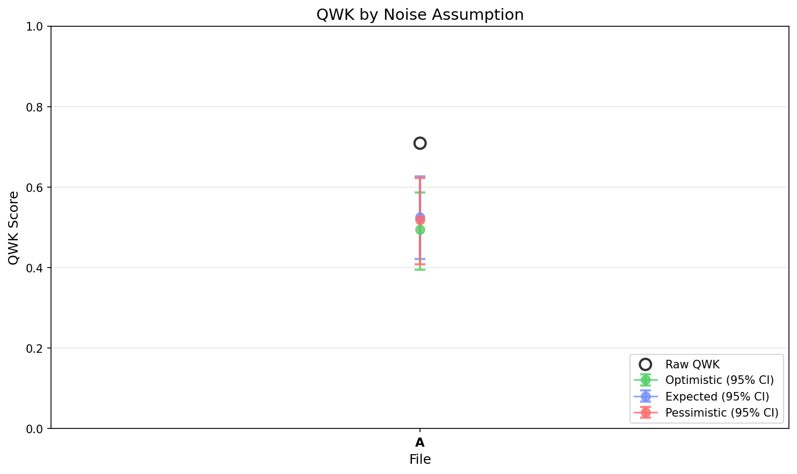

# EGF Analysis Report

**Generated:** 2026-01-02 17:08:47

**Source EDF:** sbc_task_live_a.edf

**Grading:** Custom Rubric Experiment: N=20, 168 targets, 4 permutations. Diparative grading with user-specified rubric.

**Files analyzed:** 1

## Legend

- **A**: `kelvins_rubric_on_live_data_20260102_170446.egf`

---

## Summary

| Label | Raw QWK | Exact Acc | Near Acc | CI (Expected, Combined) |
|-------|---------|-----------|----------|-------------------------|
| **A** | 0.7088 | 19.0% | 74.4% | [0.421, 0.626] |

## Visualizations

### QWK by Noise Assumption

---

## Detailed Results

Shows QWK confidence intervals under 3 noise assumptions (optimistic/expected/pessimistic) and 4 CI types.

### A (168 essays)

**Raw QWK:** 0.7088 | **Exact Acc:** 19.0% | **Near Acc:** 74.4%

| CI Type | Assumption | Mean QWK | 95% CI |
|---------|------------|----------|--------|
| Sampling Only | Optimistic | 0.7068 | [0.640, 0.768] |
| Sampling Only | Expected | 0.7068 | [0.640, 0.768] |
| Sampling Only | Pessimistic | 0.7068 | [0.640, 0.768] |
| LLM Noise | Optimistic | 0.6957 | [0.677, 0.715] |
| LLM Noise | Expected | 0.6957 | [0.677, 0.715] |
| LLM Noise | Pessimistic | 0.6957 | [0.677, 0.715] |
| Teacher Noise | Optimistic | 0.5032 | [0.442, 0.556] |
| Teacher Noise | Expected | 0.5333 | [0.461, 0.595] |
| Teacher Noise | Pessimistic | 0.5258 | [0.447, 0.596] |
| All Combined | Optimistic | 0.4945 | [0.395, 0.587] |
| All Combined | Expected | 0.5248 | [0.421, 0.626] |
| All Combined | Pessimistic | 0.5179 | [0.408, 0.622] |

