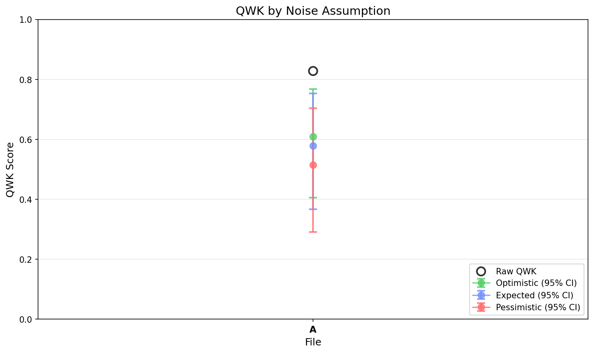

# EGF Analysis Report

**Generated:** 2026-01-02 17:09:53

**Source EDF:** sbc_task_practice_a.edf

**Grading:** Custom Rubric Experiment: N=20, 43 targets, 4 permutations. Diparative grading with user-specified rubric.

**Files analyzed:** 1

## Legend

- **A**: `kelvins_rubric_on_mason_data_20260102_164645.egf`

---

## Summary

| Label | Raw QWK | Exact Acc | Near Acc | CI (Expected, Combined) |
|-------|---------|-----------|----------|-------------------------|
| **A** | 0.8277 | 34.9% | 90.7% | [0.367, 0.753] |

## Visualizations

### QWK by Noise Assumption

---

## Detailed Results

Shows QWK confidence intervals under 3 noise assumptions (optimistic/expected/pessimistic) and 4 CI types.

### A (43 essays)

**Raw QWK:** 0.8277 | **Exact Acc:** 34.9% | **Near Acc:** 90.7%

| CI Type | Assumption | Mean QWK | 95% CI |
|---------|------------|----------|--------|
| Sampling Only | Optimistic | 0.8175 | [0.715, 0.895] |
| Sampling Only | Expected | 0.8175 | [0.715, 0.895] |
| Sampling Only | Pessimistic | 0.8175 | [0.715, 0.895] |
| LLM Noise | Optimistic | 0.8134 | [0.779, 0.840] |
| LLM Noise | Expected | 0.8134 | [0.779, 0.840] |
| LLM Noise | Pessimistic | 0.8134 | [0.779, 0.840] |
| Teacher Noise | Optimistic | 0.6299 | [0.495, 0.749] |
| Teacher Noise | Expected | 0.5981 | [0.431, 0.734] |
| Teacher Noise | Pessimistic | 0.5309 | [0.342, 0.685] |
| All Combined | Optimistic | 0.6088 | [0.405, 0.767] |
| All Combined | Expected | 0.5787 | [0.367, 0.753] |
| All Combined | Pessimistic | 0.5142 | [0.290, 0.703] |

