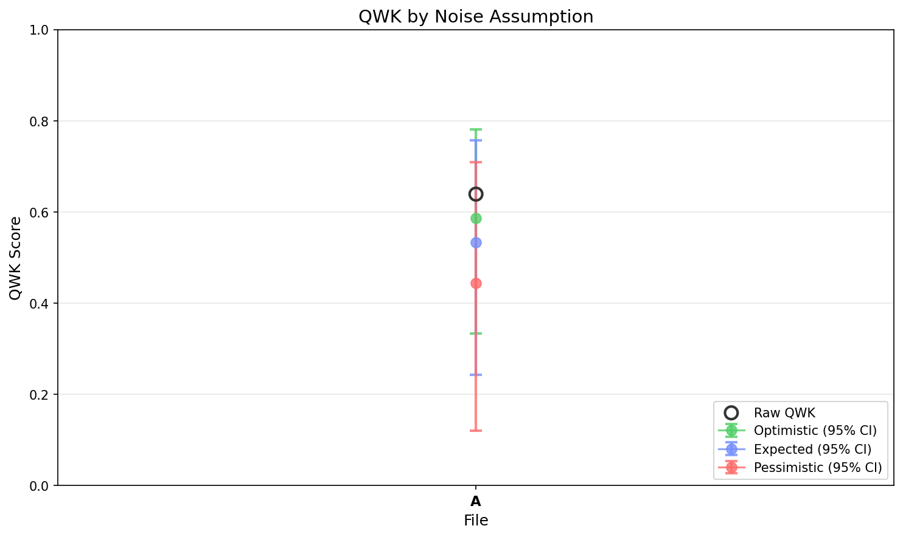

# EGF Analysis Report

**Generated:** 2026-01-02 17:10:23

**Source EDF:** nathan_low_quality_sec_a.edf

**Grading:** Custom Rubric Experiment: N=20, 22 targets, 4 permutations. Diparative grading with user-specified rubric.

**Files analyzed:** 1

## Legend

- **A**: `kelvins_rubric_on_nathan_20260102_164405.egf`

---

## Summary

| Label | Raw QWK | Exact Acc | Near Acc | CI (Expected, Combined) |
|-------|---------|-----------|----------|-------------------------|
| **A** | 0.6389 | 36.4% | 72.7% | [0.243, 0.757] |

## Visualizations

### QWK by Noise Assumption

---

## Detailed Results

Shows QWK confidence intervals under 3 noise assumptions (optimistic/expected/pessimistic) and 4 CI types.

### A (22 essays)

**Raw QWK:** 0.6389 | **Exact Acc:** 36.4% | **Near Acc:** 72.7%

| CI Type | Assumption | Mean QWK | 95% CI |
|---------|------------|----------|--------|
| Sampling Only | Optimistic | 0.6266 | [0.400, 0.802] |
| Sampling Only | Expected | 0.6266 | [0.400, 0.802] |
| Sampling Only | Pessimistic | 0.6266 | [0.400, 0.802] |
| LLM Noise | Optimistic | 0.6243 | [0.543, 0.683] |
| LLM Noise | Expected | 0.6243 | [0.543, 0.683] |
| LLM Noise | Pessimistic | 0.6243 | [0.543, 0.683] |
| Teacher Noise | Optimistic | 0.6153 | [0.526, 0.699] |
| Teacher Noise | Expected | 0.5561 | [0.382, 0.702] |
| Teacher Noise | Pessimistic | 0.4622 | [0.212, 0.672] |
| All Combined | Optimistic | 0.5869 | [0.333, 0.781] |
| All Combined | Expected | 0.5328 | [0.243, 0.757] |
| All Combined | Pessimistic | 0.4444 | [0.120, 0.708] |

