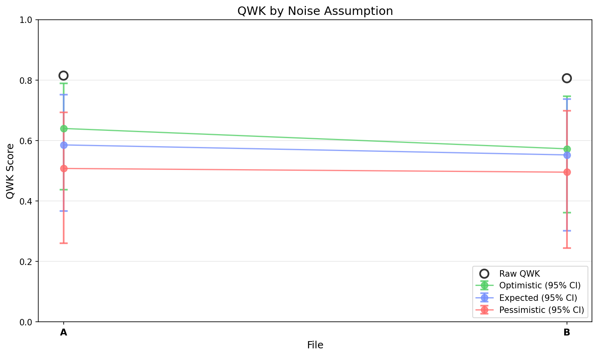
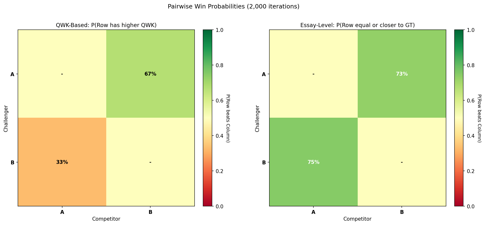

# EGF Analysis Report

**Generated:** 2026-01-02 17:00:52

**Source EDF:** sbc_task_practice_a.edf

**Grading:** Custom Rubric Experiment: N=20, 43 targets, 4 permutations. Diparative grading with user-specified rubric.

**Files analyzed:** 2

## Legend

- **A**: `first_rubric_20260102_160255.egf`

- **B**: `simple_instructions_20260102_160734.egf`

---

## Summary

| Label | Raw QWK | Exact Acc | Near Acc | CI (Expected, Combined) |
|-------|---------|-----------|----------|-------------------------|
| **A** | 0.8145 | 39.5% | 86.0% | [0.366, 0.751] |
| **B** | 0.8058 | 34.9% | 88.4% | [0.301, 0.737] |

### QWK Comparison

### Pairwise Comparison Heatmap

---

## Detailed Results

Shows QWK confidence intervals under 3 noise assumptions (optimistic/expected/pessimistic) and 4 CI types.

### A (43 essays)

**Raw QWK:** 0.8145 | **Exact Acc:** 39.5% | **Near Acc:** 86.0%

| CI Type | Assumption | Mean QWK | 95% CI |
|---------|------------|----------|--------|
| Sampling Only | Optimistic | 0.8116 | [0.708, 0.893] |
| Sampling Only | Expected | 0.8116 | [0.708, 0.893] |
| Sampling Only | Pessimistic | 0.8116 | [0.708, 0.893] |
| LLM Noise | Optimistic | 0.8040 | [0.777, 0.827] |
| LLM Noise | Expected | 0.8040 | [0.777, 0.827] |
| LLM Noise | Pessimistic | 0.8040 | [0.777, 0.827] |
| Teacher Noise | Optimistic | 0.6590 | [0.511, 0.773] |
| Teacher Noise | Expected | 0.6043 | [0.417, 0.742] |
| Teacher Noise | Pessimistic | 0.5248 | [0.325, 0.679] |
| All Combined | Optimistic | 0.6396 | [0.437, 0.789] |
| All Combined | Expected | 0.5852 | [0.366, 0.751] |
| All Combined | Pessimistic | 0.5073 | [0.260, 0.693] |

### B (43 essays)

**Raw QWK:** 0.8058 | **Exact Acc:** 34.9% | **Near Acc:** 88.4%

| CI Type | Assumption | Mean QWK | 95% CI |
|---------|------------|----------|--------|
| Sampling Only | Optimistic | 0.7945 | [0.671, 0.878] |
| Sampling Only | Expected | 0.7945 | [0.671, 0.878] |
| Sampling Only | Pessimistic | 0.7945 | [0.671, 0.878] |
| LLM Noise | Optimistic | 0.7902 | [0.751, 0.822] |
| LLM Noise | Expected | 0.7902 | [0.751, 0.822] |
| LLM Noise | Pessimistic | 0.7902 | [0.751, 0.822] |
| Teacher Noise | Optimistic | 0.5944 | [0.453, 0.719] |
| Teacher Noise | Expected | 0.5728 | [0.407, 0.715] |
| Teacher Noise | Pessimistic | 0.5127 | [0.330, 0.670] |
| All Combined | Optimistic | 0.5723 | [0.361, 0.746] |
| All Combined | Expected | 0.5521 | [0.301, 0.737] |
| All Combined | Pessimistic | 0.4951 | [0.244, 0.698] |

---

## Pairwise Comparison

P(Row N > Column N) under different noise assumptions.

### Optimistic Assumption

### QWK-Based: P(Row has higher QWK than Column)

|   | A | B |
|---|---|---|
| **A**| - | **84%** |
| **B**| _16%_ | - |

### Essay-Level: P(Row is equal or closer to GT per essay)

|   | A | B |
|---|---|---|
| **A**| - | **77%** |
| **B**| **71%** | - |

**Average QWK (across all scenarios):**
- A: 0.644
- B: 0.573

_Based on 2,000 paired bootstrap iterations._
_Values > 50% indicate the row is more likely better than the column._
_**Bold** = strong evidence (>60%), *italic* = weak evidence (<40%)._

### Expected Assumption

### QWK-Based: P(Row has higher QWK than Column)

|   | A | B |
|---|---|---|
| **A**| - | **67%** |
| **B**| _33%_ | - |

### Essay-Level: P(Row is equal or closer to GT per essay)

|   | A | B |
|---|---|---|
| **A**| - | **73%** |
| **B**| **75%** | - |

**Average QWK (across all scenarios):**
- A: 0.588
- B: 0.553

_Based on 2,000 paired bootstrap iterations._
_Values > 50% indicate the row is more likely better than the column._
_**Bold** = strong evidence (>60%), *italic* = weak evidence (<40%)._

### Pessimistic Assumption

### QWK-Based: P(Row has higher QWK than Column)

|   | A | B |
|---|---|---|
| **A**| - | 56% |
| **B**| 44% | - |

### Essay-Level: P(Row is equal or closer to GT per essay)

|   | A | B |
|---|---|---|
| **A**| - | **70%** |
| **B**| **78%** | - |

**Average QWK (across all scenarios):**
- A: 0.511
- B: 0.499

_Based on 2,000 paired bootstrap iterations._
_Values > 50% indicate the row is more likely better than the column._
_**Bold** = strong evidence (>60%), *italic* = weak evidence (<40%)._

