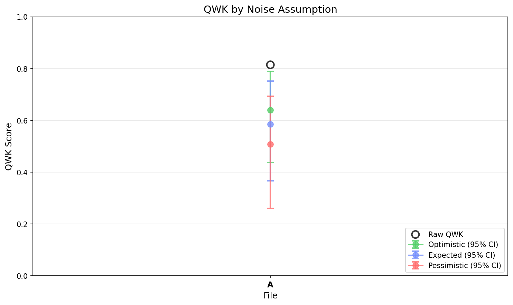

# EGF Analysis Report

**Generated:** 2026-01-02 17:03:47

**Source EDF:** sbc_task_practice_a.edf

**Grading:** Custom Rubric Experiment: N=20, 43 targets, 4 permutations. Diparative grading with user-specified rubric.

**Files analyzed:** 1

## Legend

- **A**: `first_rubric_20260102_160255.egf`

---

## Summary

| Label | Raw QWK | Exact Acc | Near Acc | CI (Expected, Combined) |
|-------|---------|-----------|----------|-------------------------|
| **A** | 0.8145 | 39.5% | 86.0% | [0.366, 0.751] |

### QWK Comparison

---

## Detailed Results

Shows QWK confidence intervals under 3 noise assumptions (optimistic/expected/pessimistic) and 4 CI types.

### A (43 essays)

**Raw QWK:** 0.8145 | **Exact Acc:** 39.5% | **Near Acc:** 86.0%

| CI Type | Assumption | Mean QWK | 95% CI |
|---------|------------|----------|--------|
| Sampling Only | Optimistic | 0.8116 | [0.708, 0.893] |
| Sampling Only | Expected | 0.8116 | [0.708, 0.893] |
| Sampling Only | Pessimistic | 0.8116 | [0.708, 0.893] |
| LLM Noise | Optimistic | 0.8040 | [0.777, 0.827] |
| LLM Noise | Expected | 0.8040 | [0.777, 0.827] |
| LLM Noise | Pessimistic | 0.8040 | [0.777, 0.827] |
| Teacher Noise | Optimistic | 0.6590 | [0.511, 0.773] |
| Teacher Noise | Expected | 0.6043 | [0.417, 0.742] |
| Teacher Noise | Pessimistic | 0.5248 | [0.325, 0.679] |
| All Combined | Optimistic | 0.6396 | [0.437, 0.789] |
| All Combined | Expected | 0.5852 | [0.366, 0.751] |
| All Combined | Pessimistic | 0.5073 | [0.260, 0.693] |

